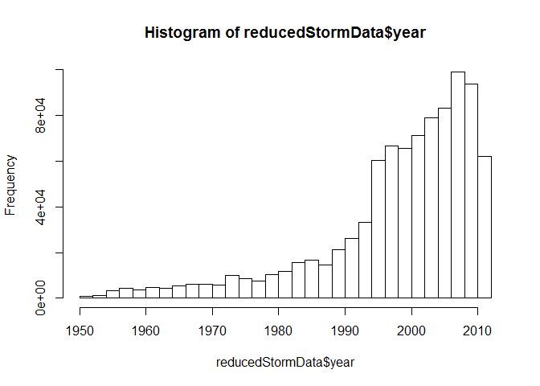
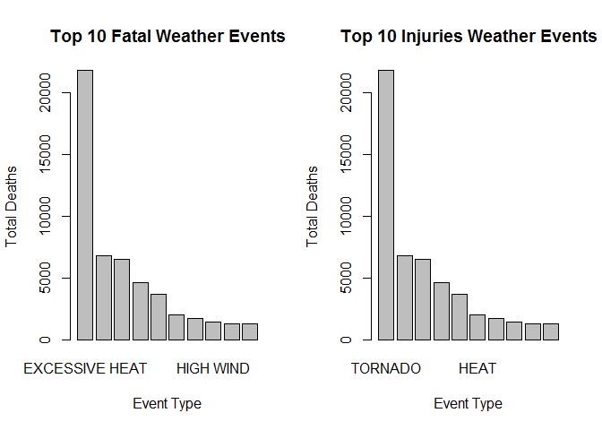
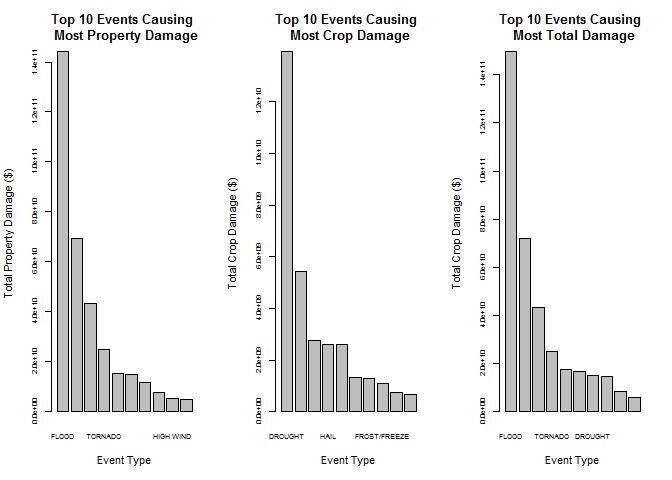

# Reproducible Research: Peer Assessment 2
grace cao  
October 22, 2015  
Analysis of different weather events in the USA based on the NOAA Storm Database, their impacts on human induries and economic damages
======================

This is an R Markdown document for Coursera course Reproducible Research project Peer Assessments 2. 
The course assignment can be found here https://class.coursera.org/repdata-033/human_grading/view/courses/975146/assessments/4/submissions

##1, Assignment

The basic goal of this assignment is to explore the NOAA Storm Database and answer some basic questions about severe weather events. You must use the database to answer the questions below and show the code for your entire analysis. 

Your data analysis must address the following questions:

* Across the United States, which types of events (as indicated in the EVTYPE variable) are most harmful with respect to population health?

* Across the United States, which types of events have the greatest economic consequences?

##2, Synopsis
Storm and other severe weather events can cause both public health and economic problems for communities and municipalities. Many sever events can results in fatalities, injuries and property damage. Preventing such outcomes to the extent possible is a key concern. The U.S. National Oceanic and Atmospheric Administration's (NOAA) storm database tracks characteristics of major storms and weather events in the United States, include when and where they occur, aswell as estimates of any fatalities, injuries and property damage. This report contains the exploratory analysis results on the health and economic impact by the severe weather events based on the data from NOAA database.

##3, Data Processing
Download and Read the data file from course assignment website

####3.1 Load libraries

```r
library(R.utils) # for bunzip2

library(dplyr) # 
```
####3.2 download file from URL, read the data into R

```r
downloadData <- function() {
    if (!file.exists("./repdata-data-StormData.csv.bz2")) {
        download.file("https://d396qusza40orc.cloudfront.net/repdata%2Fdata%2FStormData.csv.bz2", 
                      "./repdata-data-StormData.csv")
    }
    # unzip file
    if (!file.exists("repdata-data-StormData.csv")) {
        
        bunzip2("./repdata-data-StormData.csv.bz2", "./repdata-data-StormData.csv", remove = FALSE)
    }
}

needLoadData <- TRUE
if(needLoadData){
    downloadData()
    # load data into R
    storm <- read.csv("./repdata-data-StormData.csv")
    head(storm, 2)
}
```

```
##   STATE__          BGN_DATE BGN_TIME TIME_ZONE COUNTY COUNTYNAME STATE
## 1       1 4/18/1950 0:00:00     0130       CST     97     MOBILE    AL
## 2       1 4/18/1950 0:00:00     0145       CST      3    BALDWIN    AL
##    EVTYPE BGN_RANGE BGN_AZI BGN_LOCATI END_DATE END_TIME COUNTY_END
## 1 TORNADO         0                                               0
## 2 TORNADO         0                                               0
##   COUNTYENDN END_RANGE END_AZI END_LOCATI LENGTH WIDTH F MAG FATALITIES
## 1         NA         0                        14   100 3   0          0
## 2         NA         0                         2   150 2   0          0
##   INJURIES PROPDMG PROPDMGEXP CROPDMG CROPDMGEXP WFO STATEOFFIC ZONENAMES
## 1       15    25.0          K       0                                    
## 2        0     2.5          K       0                                    
##   LATITUDE LONGITUDE LATITUDE_E LONGITUDE_ REMARKS REFNUM
## 1     3040      8812       3051       8806              1
## 2     3042      8755          0          0              2
```

####3.4 Reduce the data based on the column that we need for this analysis
reduce storm data, only keep needed column: BGN_DATE, EVTYPE, FATALITIES, INJURIES, PROPDMG, PROPDMGEXP, CROPDMG, CROPDMGEXP


```r
keepCol <- c("BGN_DATE", "EVTYPE", "FATALITIES", "INJURIES", "PROPDMG", "PROPDMGEXP", "CROPDMG", "CROPDMGEXP")
reducedStormData <- storm[, keepCol]
```


####3.5 Reduce the data by year and date
There are 902297 rows and 8 columns in reduced Storm Data. The events in the database start in the year 1950 and end in November 2011. In the earlier years of the database there are generally fewer events recorded, most likely due to a lack of reliable/complete records.

```r
reducedStormData$year <- as.numeric(format(as.Date(reducedStormData$BGN_DATE, format = "%m/%d/%Y %H:%M:%S"), "%Y"))

hist(reducedStormData$year, breaks = 30)
```

 

```r
quantile(reducedStormData$year, 0.25)
```

```
##  25% 
## 1995
```

Histogram shows that 1995 to 2011 covers 75% of the total record collected. We will reduce the data starting from 1995


```r
rStorm <- reducedStormData[reducedStormData$year >= 1995, ]
dim(rStorm)
```

```
## [1] 681500      9
```


##4, Results

####4.1, Across the United States, which types of events (as indicated in the EVTYPE variable) are most harmful with respect to population health?

There two typse of data are analysized, fatality and indury. 


```r
rStorm_tbl <- tbl_df(rStorm)
byFATALITIES <- group_by(rStorm_tbl, EVTYPE)
top10Fatalities<- summarise(byFATALITIES,
                total = sum(FATALITIES)
) %>% arrange(desc(total)) %>% top_n(10)
```

```
## Selecting by total
```

```r
top10Fatalities
```

```
## Source: local data frame [10 x 2]
## 
##            EVTYPE total
##            (fctr) (dbl)
## 1  EXCESSIVE HEAT  1903
## 2         TORNADO  1545
## 3     FLASH FLOOD   934
## 4            HEAT   924
## 5       LIGHTNING   729
## 6           FLOOD   423
## 7     RIP CURRENT   360
## 8       HIGH WIND   241
## 9       TSTM WIND   241
## 10      AVALANCHE   223
```

Excess Heat caused most of the fatalities.


```r
byINJURIES <- group_by(rStorm_tbl, EVTYPE)
top10Induries <- summarise(byINJURIES ,
                 total = sum(INJURIES)
) %>% arrange(desc(total)) %>% top_n(10)
```

```
## Selecting by total
```

```r
top10Induries
```

```
## Source: local data frame [10 x 2]
## 
##               EVTYPE total
##               (fctr) (dbl)
## 1            TORNADO 21765
## 2              FLOOD  6769
## 3     EXCESSIVE HEAT  6525
## 4          LIGHTNING  4631
## 5          TSTM WIND  3630
## 6               HEAT  2030
## 7        FLASH FLOOD  1734
## 8  THUNDERSTORM WIND  1426
## 9       WINTER STORM  1298
## 10 HURRICANE/TYPHOON  1275
```

Tornado caused most of the injuries. 


```r
par(mfrow=c(1,2))
barplot(top10Induries$total, 
        names = top10Fatalities$EVTYPE,
        xlab = "Event Type",
        ylab = "Total Deaths",
        main = "Top 10 Fatal Weather Events")


barplot(top10Induries$total, 
        names = top10Induries$EVTYPE,
        xlab = "Event Type",
        ylab = "Total Deaths",
        main = "Top 10 Injuries Weather Events")
```

 


####4.2, Across the United States, which types of events have the greatest economic consequences?
We will convert the property damage and crop damage data into comparable numerical forms using the definition of the units described in the code book (Storm Events). Both PROPDMGEXP and CROPDMGEXP columns record a multiplier for each observation where we have Hundred (H), Thousand (K), Million (M) and Billion (B).

Helper function to convert symbol to a power of 10 (for use with PROPDMGEXP & CROPDMGEXP)

```r
toTenPower <- function(x){
    if(is.numeric(x)) {
        x <- x
    }
    else if(grepl("h", x, ignore.case=TRUE)) {
        x <- 2
    }
    else if(grepl("k", x, ignore.case=TRUE)) {
        x <- 3
    }
    else if(grepl("m", x, ignore.case=TRUE)) {
        x <- 6
    }
    else if(grepl("b", x, ignore.case=TRUE)) {
        x <- 9
    }
    else if(x == "" || x == " "){
        x <- 0
    }
    else{
        x <- NA
    }
    x
}
# function to take two parameters num and exp and convert it to one absolute value. non integers become 0
calculateAmount <- function(num, exp){
    pow <- toTenPower(exp)
    if(is.numeric(num)){
        num <- num * (10 ^ pow)
    }
    
    if(!is.numeric(num)){
        num <- 0
    }
    
    num
}
```

create 2 new fields for calculated propDamage & cropDamage and add them to one damageTotal field


```r
rStorm$propDamage <- mapply(calculateAmount, rStorm$PROPDMG, rStorm$PROPDMGEXP)
rStorm$cropDamage <- mapply(calculateAmount, rStorm$CROPDMG, rStorm$CROPDMGEXP)

propDam <- aggregate(propDamage~EVTYPE, data=rStorm, sum)
propDam_reorder<- propDam[order(-propDam$propDamage),]
propDam10<-propDam_reorder[1:10,]

cropDam <- aggregate(cropDamage~EVTYPE, data=rStorm, sum)
cropDam_reorder<- cropDam[order(-cropDam$cropDamage),]
cropDam10<-cropDam_reorder[1:10,]

totalDam <- aggregate(propDamage + cropDamage~EVTYPE, data=rStorm, sum)
names(totalDam)[2] <- "total"
totalDam10 <- arrange(totalDam, desc(total)) %>% top_n(10)
```

```
## Selecting by total
```

List out the tables for property damage, crop damange, and total damage.


```r
propDam10
```

```
##                EVTYPE   propDamage
## 143             FLOOD 144022037057
## 311 HURRICANE/TYPHOON  69305840000
## 517       STORM SURGE  43193536000
## 664           TORNADO  24925719460
## 133       FLASH FLOOD  15365932517
## 204              HAIL  15045721872
## 304         HURRICANE  11812819010
## 675    TROPICAL STORM   7653335550
## 286         HIGH WIND   5259785360
## 771          WILDFIRE   4759064000
```

```r
cropDam10
```

```
##                EVTYPE  cropDamage
## 84            DROUGHT 13922066000
## 143             FLOOD  5422810400
## 305         HURRICANE  2741410000
## 205              HAIL  2614127050
## 312 HURRICANE/TYPHOON  2607872800
## 134       FLASH FLOOD  1343915000
## 121      EXTREME COLD  1292473000
## 178      FROST/FREEZE  1094086000
## 240        HEAVY RAIN   728399800
## 676    TROPICAL STORM   677836000
```

```r
totalDam10
```

```
##               EVTYPE        total
## 1              FLOOD 149444847457
## 2  HURRICANE/TYPHOON  71913712800
## 3        STORM SURGE  43193541000
## 4            TORNADO  25222145070
## 5               HAIL  17634843922
## 6        FLASH FLOOD  16709257517
## 7            DROUGHT  14968172000
## 8          HURRICANE  14554229010
## 9     TROPICAL STORM   8331171550
## 10         HIGH WIND   5893346660
```


```r
par(mfrow=c(1,3))
barplot(propDam10$propDamage, 
        names = propDam10$EVTYPE,
        cex.names = 0.7,
        cex.axis = 0.7,
        xlab = "Event Type",
        ylab = "Total Property Damage ($)",
        main = "Top 10 Events Causing \n Most Property Damage")
barplot(cropDam10$cropDamage, 
        names = cropDam10$EVTYPE,
        cex.names = 0.7,
        cex.axis = 0.7,
        xlab = "Event Type",
        ylab = "Total Crop Damage ($)",
        main = "Top 10 Events Causing \n Most Crop Damage")
barplot(totalDam10$total, 
        names = totalDam10$EVTYPE,
        cex.names = 0.7,
        cex.axis = 0.7,
        xlab = "Event Type",
        ylab = "Total Crop Damage ($)",
        main = "Top 10 Events Causing \n Most Total Damage")
```

 

Based on the data, FLOOD caused the most property damage. DROUGHT caused the most crop damange. FLOOD caused the most total damage.
